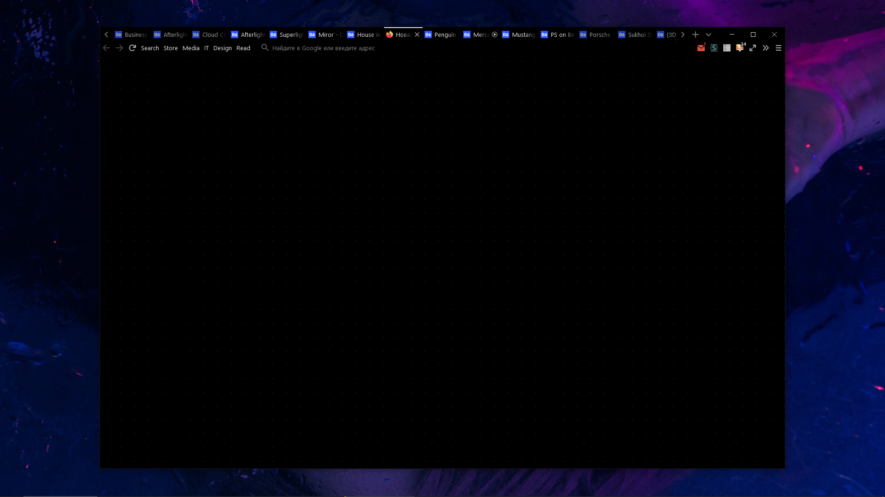
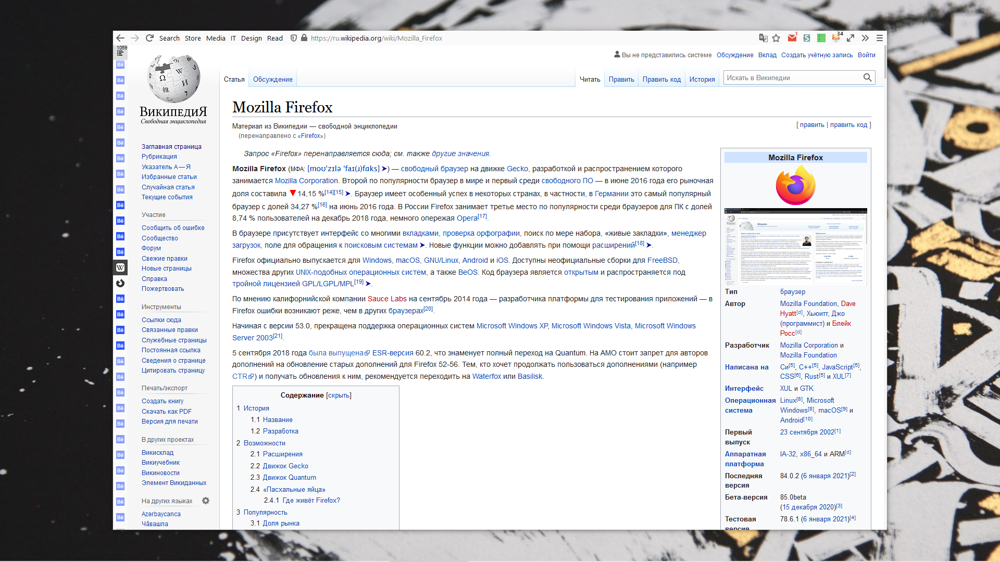

# firefox-sidebery-minimal-style
Universal minimal style for Firefox and Sidebery. Reduced thickness - 28px.

# Install Firefox Style
1. In about:config enable pref toolkit.legacyUserProfileCustomizations.stylesheets
2. Open about:support
3. Click on "Profile Folder" -> "Open Folder"
4. Create a sub-folder named "chrome"
5. Change into the new folder
6. Add files "userChrome.css" "userContent.css"
7. Restart Firefox
8. In Customize... :
 - Select Default theme. The color scheme depends on the OS
 - Select Compact icons
 - Drag Bookmarks Toolbar Items to the left of the address bar. Disable Bookmarks Toolbar

# Install Sidebery Style
1. Install https://addons.mozilla.org/firefox/addon/sidebery/
2. Copy the code from SideberySidebar.css to Sidebery / Settings / Styles editor / Sidebar
3. Copy the code from SideberyGroupPage.css to Sidebery / Settings / Styles editor / Group page
4. Enable the option: Sidebery / Settings / Help / Add preface to the browser window's title if sidebery is active. This will hide the top tabs.

# Settings css
 - If you need window control buttons - unlock code `Show window buttons - + x`

# Recommended settings about:config
- Opening a bookmark in a new tab
`browser.tabs.loadBookmarksInTabs` `true`
- Open tabs to the right of the current one
`browser.tabs.insertAfterCurrent` `true`
- Scroll step
`mousewheel.min_line_scroll_amount` `25`
- Smoothness of scrolling
`general.smoothScroll.mouseWheel.durationMaxMS` `380`
- Number of recently closed tabs
`browser.sessionstore.max_tabs_undo` `250`
- Disable warning when going to full screen mode
`full-screen-api.warning.timeout` `0`
- Disable add-on recommendations
`extensions.htmlaboutaddons.recommendations.enabled` `false`
- Disable two-step search
`browser.urlbar.update2` `false`
- Disable sponsored sites
`browser.newtabpage.activity-stream.showSponsored` `false`

# Screenshots

